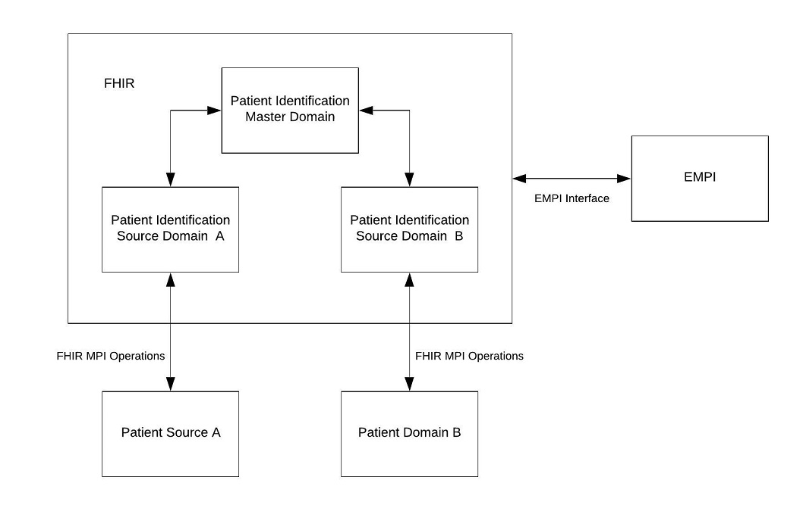

## FHIR MPI Interface 
Version 1.0
28 June 2019

Fast River Technologies Inc.

## Introduction
This document introduces a collection of FHIR MPI (Master Patient Index), or eMPI (Enterprise Master Patient Index), operations which extend FHIR R4 Patient match operation. The document defines the request of each MPI operation,  the response of each MPI operation, operation outcome details, and error conditions for the transactions of MPI operations.  Traditionally, the MPI interfaces are always vendor-specific, proprietary, and complicated. Integrating healthcare information systems with an MPI is still tricky and vendor locked. The FHIR MPI operations are aimed to overcome these challenges for the FHIR-based systems. 

## Scope
This document describes the MPI functionality through defining FHIR MPI operations. It does not address the underlying implementation and integration of MPI functionality.

## Assumptions
This document assumes FHIR Specification R4, which is the current officially released normative version at the time of this writing.

## Integration FHIR with MPI
A Master Patient Index (MPI) or an Enterprise Master Patient Index (EMPI) provides a single source of truth about a patient within or across healthcare organization systems, ensuring the accuracy and consistency of the unified and trusted patient data.  An MPI generates a golden patient record or a master patient record from a set of similar-enough patient records and assigns a unique enterprise -level identifier by using matching, merging, and deduplicating.  These similar enough patient records are linked together and represent the same patient.  The patient data is used for matching is a subset of patient demographic information, including name, gender, date of birth, social security number, address, and contact information. 

One or more identifiers pinpoints a patient resource.  A namespace or system issues a unique identifier within the issuing system to a patient.  A namespace or a system also considers as a patient identifier domain. An MPI is a master patient identification domain, which is also named MPI domain in this document. The MPI domain assigns a unique enterprise-level identifier to each golden patient record or master patient record by the underlying MPI.  A set of similar-enough patients from distinct patient identifier domains links together with a unique enterprise-level identifier from the MPI domain to embody the same patient.

